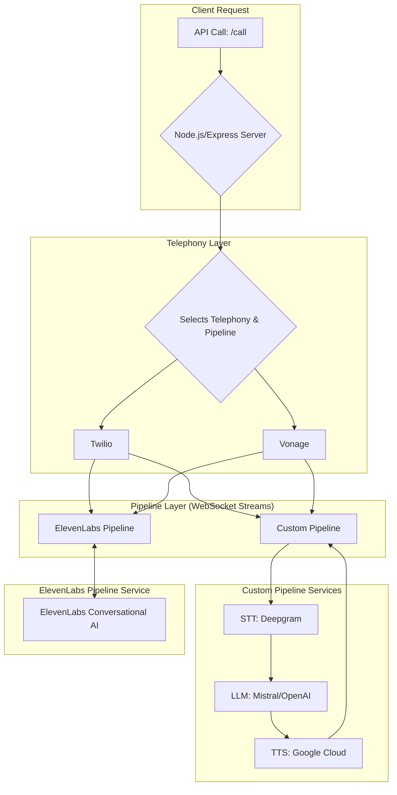

# 🚀 Modular Conversational AI Voice Agent Framework 🚀

A powerful, plug-and-play voice agent backend designed for building sophisticated, real-time conversational AI experiences. This framework supports dual telephony providers (Twilio and Vonage) and features interchangeable audio processing pipelines, allowing you to switch between a fully custom-built solution and the ultra-realistic voices of ElevenLabs with a single API call.

This project is the perfect foundation for businesses looking to build custom voice-based customer service agents, AI-powered outbound sales callers, intelligent personal assistants, and more.

---

## ✨ Features

*   **Dual Telephony Support:** Seamlessly integrate with either **Twilio** or **Vonage** to make and receive calls.
*   **Interchangeable Pipelines:**
    *   🧪 **Custom Pipeline:** A flexible and powerful pipeline using best-in-class services: **Deepgram** for Speech-to-Text, **Mistral** or **OpenAI** for language model intelligence, and **Google Cloud** for Text-to-Speech.
    *   🤖 **ElevenLabs Pipeline:** Leverage the state-of-the-art **ElevenLabs Conversational AI API** for incredibly low-latency, human-like voice interactions.
*   **Real-time Audio Streaming:** Built with WebSockets for bidirectional, low-latency audio streaming, ensuring conversations flow naturally.
*   **Modular Architecture:** The core logic is designed to be easily extensible, allowing for new services, pipelines, or features (like function calling) to be added with minimal effort.
*   **Intelligent Audio Handling:** The system automatically handles the different audio formats required by each service (`µ-law`, `PCM`), performing efficient, real-time conversions only when necessary.

---

## 🏗️ System Architecture

The framework is built around a central Express.js server that manages API calls and WebSocket connections. When a call is initiated, it connects to a specific WebSocket endpoint corresponding to the desired telephony provider and pipeline.



### Audio Flow Deep Dive

*   **Custom Pipeline:** Audio from Twilio (`ulaw_8000`) or Vonage (`pcm_8000`) is streamed to our server, transcribed by Deepgram, sent to an LLM, synthesized into speech by Google Cloud TTS, and finally streamed back. For Vonage, an `ffmpeg` process handles the final conversion to the required raw audio format.
*   **ElevenLabs Pipeline:** The system is optimized for performance. Audio from **Twilio** (`ulaw_8000`) is passed directly to ElevenLabs without conversion. Audio from **Vonage** (`pcm_8000`) undergoes a highly efficient, one-way conversion to `ulaw_8000` before being sent to ElevenLabs.

---

## 🛠️ Technology Stack

| Category              | Technology / Service                                 |
| --------------------- | ---------------------------------------------------- |
| **Backend**           | Node.js, Express.js, WebSockets                      |
| **Telephony**         | Twilio, Vonage                                       |
| **Speech-to-Text**    | Deepgram, ElevenLabs                                 |
| **Text-to-Speech**    | Google Cloud TTS, ElevenLabs                         |
| **Language Models**   | Mistral, OpenAI, ElevenLabs                          |
| **Audio Conversion**  | `pcm-convert`                                        |

---

## ⚙️ Setup and Installation

### Prerequisites
*   Node.js (v18 or higher)
*   An [ngrok](https://ngrok.com/) account to expose your local server to the internet.

### 1. Clone the Repository
```bash
git clone <your-repo-url>
cd <your-repo-directory>
```

### 2. Install Dependencies
```bash
npm install
```

### 3. Configure Environment Variables
Create a file named `.env` in the root of the project and paste the following content into it. You must fill in the values for the services you intend to use.

```ini
# --- Server Configuration ---
PORT=8080
# Your server's public URL (e.g., your-ngrok-url.ngrok-free.app). Do not include https://
SERVER_URL=

# --- Twilio Configuration ---
# Your Twilio Account SID from the Twilio console
TWILIO_ACC=
# Your Twilio Auth Token from the Twilio console
TWILIO_KEY=
# Your Twilio phone number (must be purchased from Twilio)
FROM_NUMBER=

# --- Vonage Configuration ---
# Your Vonage Application ID from the Vonage console
VONAGE_APPLICATION_ID=
# The absolute path to your Vonage private key file (e.g., /Users/user/project/private.key)
VONAGE_PRIVATE_KEY_PATH=
# Your Vonage phone number (must be purchased from Vonage)
VONAGE_NUMBER=

# --- Custom Pipeline Services ---
# Your Deepgram API Key for STT
DEEPGRAM_API_KEY=
# The absolute path to your Google Cloud service account JSON file for TTS
GOOGLE_APPLICATION_CREDENTIALS=
# Your OpenAI API Key for the LLM
OPENAI_API_KEY=
# Your Mistral API Key for the LLM
MISTRAL_API_KEY=

# --- ElevenLabs Pipeline ---
# Your ElevenLabs API Key
ELEVENLABS_API_KEY=
# The ID of the ElevenLabs Voice Agent you want to use
AGENT_ID=
```

### 4. Service-Specific Setup

*   **Telephony Numbers:** You must purchase a phone number from both [Twilio](https://www.twilio.com/console) and [Vonage](https://dashboard.vonage.com/) to use as your `FROM_NUMBER` and `VONAGE_NUMBER` respectively.
*   **ElevenLabs:**
    1.  Go to the ElevenLabs website and create a new Voice Agent.
    2.  Note the **Agent ID** and your **API Key**.
    3.  **CRITICAL:** In the agent's settings, set the audio format for both **Input** and **Output** to **`ulaw_8000`**. This is essential for low-latency performance.
*   **Google Cloud:**
    1.  Create a service account with access to the Text-to-Speech API.
    2.  Download the JSON credentials file and provide its absolute path in the `.env` file.
*   **ngrok:**
    1.  Run `ngrok http 8080` in a separate terminal.
    2.  Copy the `https` forwarding URL (e.g., `https://your-ngrok-url.ngrok-free.app`) and paste the domain part into the `SERVER_URL` variable in your `.env` file (without `https://`).

### 5. Start the Server
```bash
npm start
```

---

## ▶️ Usage

Initiate calls by sending a GET request to the `/call` endpoint. You can mix and match the `callerservice`, `pipeline`, and `llm` parameters to use any supported combination.

**Example (Twilio + ElevenLabs):**
```bash
curl "http://localhost:8080/call?callerservice=twilio&pipeline=elevenlabs&toNumber=+1234567890"
```

**Example (Vonage + Custom Pipeline with OpenAI):**
```bash
curl "http://localhost:8080/call?callerservice=vonage&pipeline=new_custom&llm=openai&toNumber=+1234567890"
```

**Available Options:**
*   `callerservice`: `twilio`, `vonage`
*   `pipeline`: `new_custom`, `elevenlabs`
*   `llm`: `mistral`, `openai` (only for `new_custom` pipeline)

---

## 🗺️ Roadmap: Task Performing is Coming Soon!

The next exciting step for this framework is to empower the agents to do more than just talk. Future development will focus on integrating tools and APIs so the agent can **perform tasks in the real world**, such as looking up information, booking appointments, or interacting with external systems.
